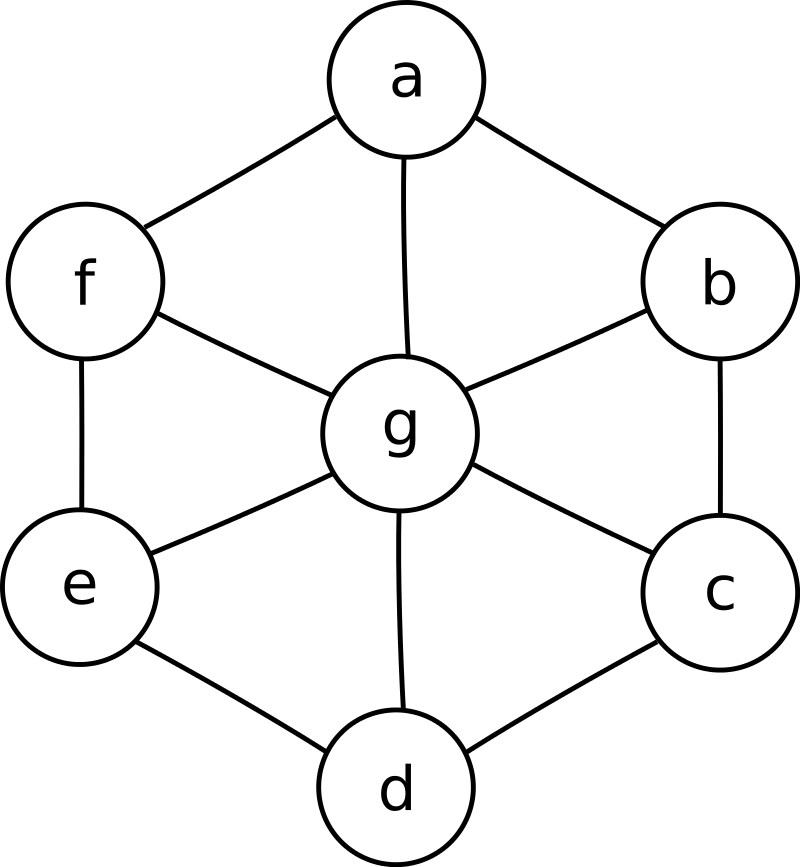

# DSatur VS Recusive Largest First(RLF)

O objetivo da implementação desse algoritmo é de realizar a comparação de dois modos diferentes para se realizar a coloração de Grafos sendo esses dois algoritmos o DSatur e o RLF, e analisar se os mesmo sao bons algoritmos para resolver Sudokus.

Documentação: <a href="https://kingdrasill.github.io/DSaturVsRLF/">https://kingdrasill.github.io/DSaturVsRLF/</a>

Integrantes: Gabriel Teixeira e Marcus Vinícius

# DSatur

DSatur é um algoritmo usado para a coloração de grafos que foi inicialmente apresentado por Daniel Brélaz em 1979, o DSatur é similiar ao algoritmo de coloração guloso, colorindo um vertice do grafo um após o outro, adicionando uma cor não usada anteriormente quando necessário. Uma vez que um novo vértice foi colorido, o algoritmo determina qual dos vértices não coloridos restantes tem o maior número de cores em sua vizinhança e colore esse vértice a seguir.

### Pseudocódigo DSatur
<ol>
<li>Deixar <i>V</i> ser o vértice não colorido em <i>G</i> com o maior grau de saturação. Em casos de empates, escolha o vértice dentre estes de maior grau no subgrafo induzido pelos vértices incolores.</l1>

<li>Atribuir <i>V</i> para o rótulo de cor mais baixo não sendo usado por nenhum de seus vizinhos.</l1>

<li>Se todos os vértices foram coloridos, end; caso contrário, retorne ao Passo 1.</l1>
</ol>

# Recursive Largest First (RLF)
O algoritmo Recursive Largest First é uma heurística para o problema de coloração de grafos NP-difícil . Foi originalmente proposto por Frank Leighton em 1979.

O algoritmo RLF atribui cores aos vértices de um grafo construindo cada classe de cor uma de cada vez. Ele faz isso identificando um conjunto independente máximo de vértices no gráfico, atribuindo-os à mesma cor e, em seguida, removendo esses vértices do gráfico. Essas ações são repetidas no subgrafo restante até que nenhum vértice permaneça.

### Pseudocódigo RLF
O algoritmo pode ser descrito pelas três etapas a seguir. Ao final desse processo, <i>S</i> dá uma partição dos vértices que representam um viável |<i>S</i>| -coloração do gráfico <i>G</i>.

<ol>
<li>Deixar <i>S = 0</i> ser uma solução vazia. Além disso, deixe <i>G=(V,E)</i> ser o grafo que desejamos colorir, compreendendo um conjunto de vértices <i>V</i> e um conjunto de arestas <i>E</i>.</li>

<li>Identifique um conjunto independente maximal <i> S ⊆ V</i>. Para fazer isso:
<ol>
<li>O primeiro vértice adicionado a <i>S</i> deve ser o vértice em <i>G</i> que tem o maior número de vizinhos.
</li>
<li>
Vértices subseqüentes adicionados a <i>S</i> devem ser escolhidos como aqueles que (a) não são atualmente adjacentes a nenhum vértice em <i>S</i> , e (b) ter um número máximo de vizinhos que são adjacentes aos vértices em <i>S</i>. Os empates na condição (b) podem ser quebrados selecionando o vértice com o número mínimo de vizinhos fora da <i>S</i>. Os vértices são adicionados a <i>S</i> desta forma até que seja impossível adicionar mais vértices.
</li>
</ol>

</li>

<li>Agora definido <i>S = S ∪ {S}</i> e remover os vértices de <i>S</i> a partir de <i>G</i> . Se <i>G</i> ainda contém vértices, então retorne ao Passo 2; caso contrário, terminar.</li>
</ol>

# Exemplo 
Tanto o gráfico DSatur e RLF são gráficos de rodas apresentados pela imagem abaixo

### Resolução DSatur
A execução do algoritmo resulta na seleção e coloração dos vértices da seguinte forma.

<ul>
  <li>Vértice <i>G</i> (cor 1)</li>
  <li>Vértice <i>A</i> (cor 2)</li>
  <li>Vértice <i>B</i> (cor 3)</li>
  <li>Vértice <i>C</i> (cor 2)</li>
  <li>Vértice <i>D</i> (cor 3)</li>
  <li>Vértice <i>E</i> (cor 2)</li>
  <li>Vértice <i>F</i> (cor 3)</li>
</ul>

### Resolução RLF
A execução do algoritmo resulta na seleção e coloração dos vértices na seguinte ordem:

<ul>
  <li>Vértice <i>G</i> (cor 1)</li>
  <li>Vértice <i>A,C</i>, e <i>E</i> (cor 2)</li>
  <li>Vértice <i>B,D</i>, e <i>F</i> (cor 3)</li>
</ul>

Isso dá a solução tricolor final <i>S= {{G},{A,C,E},{B,D,F}}</i>

# Sudokus como grafos
Um sudoku consegue ser representado na forma de um grafo da seguinte maneira:

<ul>
  <li>Cada célula do sudoku vai ser um vértice</li>
  <li>Para cada célula existe uma aresta com as células do mesmo bloco, coluna e linha</li>
</ul>

Conseguindo transformar o sudoku em um grafo, pode se tentar resolver ele por coloração de vértices pois a coloração de vérice segue as regras do sudoku, ou seja, em vez de números usa-se cores e todo vértice não pode ter a mesma cor que um vértice adjacente a ele. Podendo resolver os sudokus como grafos por coloração de vértices teve-se a ideia de usar as formas básicas dos algoritmos de coloração de vértices DSatur e RLF para tentar resolver sudokus e comparar os dois algoritmos na questçao de resolver sudokus.

# Resultados
Com base na execução, com 100 grafos aleatórios com 30 vértices e 200 arestas, do algoritmo obtivemos os seguintes resultados:

<ol>
<li>O tempo médio na coloração de grafos por meio do algoritmo DSatur foi de 91.64 ms</li>
<li>O tempo médio na coloração de grafos por meio do algoritmo RLF foi de 744.51 ms</li>
</ol>

Tambem foram realizados os teste em resolução de problemas Sudokus 2x2, tanto 3x3, com ambos foram gerados 100 suokus em que no 2x2 havia 2 células com cores e no 3x3 havia 5 células com cores, e os resultados obtidos foram: 

<ol>

<li>Sudokus 2x2
  
Tempo medio em microsegundos do algoritmo DSatur: 52 
Porcentagem de sudokus resolvidos corretamente pelo DSatur: 73%
  
Tempo medio em microsegundos do algoritmo RLF: 315.03 
Porcentagem de sudokus resolvidos corretamente pelo RLF: 90%
  
</li>
<li>Sudokus 3x3
  
Tempo medio em microsegundos do algoritmo DSatur: 400.28 
Porcentagem de sudokus resolvidos corretamente pelo DSatur: 0%
  
Tempo medio em microsegundos do algoritmo RLF: 21116.1 
Porcentagem de sudokus resolvidos corretamente pelo RLF: 55%

</li>
</ol>

# Conclusão
Pode ser concluido que para tanto grafos aleatórios e sudokus aleatórios o algoritmo DSatur é bem mais rápido que o algoritmo RLF, só que o algoritmo consegue criar colorações para os vértices de forma muita melhor do que as do DSatur por causa disto que ele consegue resolver muita mais sudokus que o DSatur, como pode ser visto nos resultados. Isto aconteceu pois o DSatur e RLF são algoritmos aproximados e não exatos.

Como pode ser visto nos resultados dos sudokus as formas básicas dos alogritmos não são uma forma boa de resolver sudokus, pois ambas dependem de algo importante que o grau dos vértices mas como no sudoku os graus dos vértices são praticamente iguais eles os algoritmos não conseguem de forma boa desfazer os desempates que ocorrem neles.

Outra conclusão é que o algoritmo DSatur não é bom para resolver sudokus, só que ele é bom para resolver de forma rápida uma coloração de vértices mas sem ter uma coloração muito boa. Já o algoritmo RLF é bem melhor para resolver sudokus mas nem sempre, só que ele é ruim para resolver de forma rápida uma coloração de vértices mas tem uma ótima coloração.  

# Compilação e Execução

O algoritmo possui um arquivo Makefile que realiza todo o procedimento de compilação e execução. Para tanto, temos as seguintes diretrizes de execução:

| Comando                |  Função                                                                                           |                     
| -----------------------| ------------------------------------------------------------------------------------------------- |
|  `make clean`          | Apaga a última compilação realizada contida na pasta build                                        |
|  `make`                | Executa a compilação do programa utilizando o gcc, e o resultado vai para a pasta build           |
|  `make run`            | Executa o programa da pasta build após a realização da compilação                                 |

Depois do código ser compilado vai ser perguntado ao usuário se ele que comparar os algoritmos para grafos aleatórios ou sudokus aleatórios.

Se for escolhido grafos aleatórios vai ser perguntado depois quantos grafos devem ser gerados, o número de vértices(V) e o números de arestas(E), no máximo E=V*(V-1), para todos os grafos greados. 

Se for escolhidos sudokus aleatórios vai ser perguntado depois o tamanho dos sudokus a serem gerados, o números de sudokus a serem gerados e o números de células que começam com cores.

Trabalho realizado Gabriel Teixeira e Marcus Vinícius - Novembro/2022

